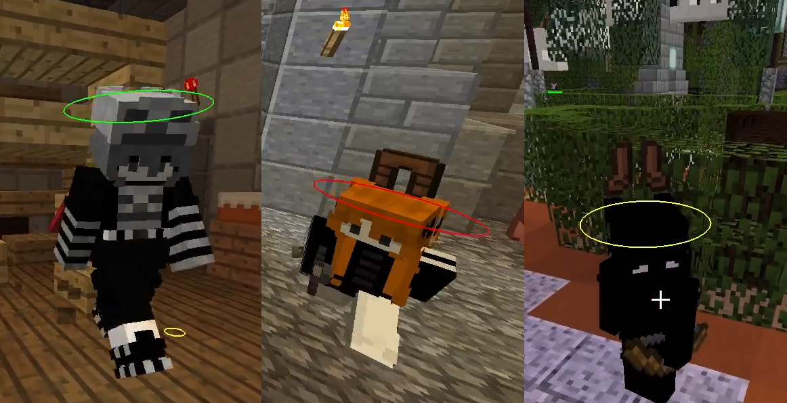

## Introduction
Murderer is a mod for legacy Minecraft Forge 1.12.2 that shows the roles of players (killer, detective or innocent) in a murder mystery mini game.

## Getting started
Murderer mod requires Minecraft Forge 1.12.2. Download the jar file from the latest release (or build it manually from source) and copy it to you mods directory. Check if the mod is loaded through the Forge mods menu.

Use `/murderer enable` to enable mod and `/murderer disable` to disable respectively. You can also assign a toggle key in the settings menu.

Please note that the founded roles will be reset upon restart.
